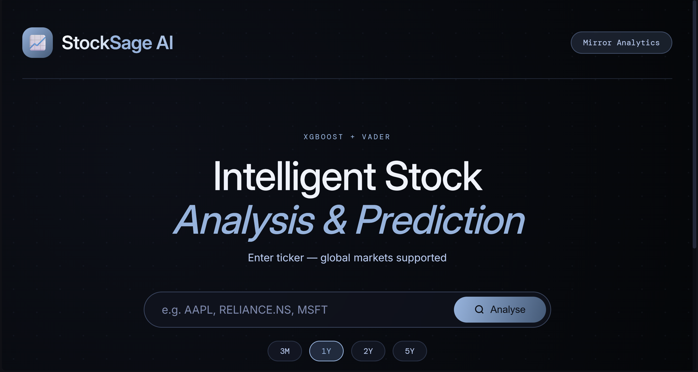

# StockSage AI – AI-Powered Stock Analysis & Prediction Platform

An intelligent stock analysis platform that combines technical analysis, financial news sentiment, machine learning, risk assessment, and multi-horizon forecasting to generate explainable investment insights.

Built using Flask, XGBoost, VADER Sentiment Analysis, and modern web technologies, StockSage AI enables users to analyze publicly traded stocks and receive data-driven BUY, HOLD, or SELL recommendations.

---

## Features

### Technical Analysis

* Simple Moving Averages (SMA 20, SMA 50)
* Exponential Moving Averages (EMA 12, EMA 26)
* Relative Strength Index (RSI)
* MACD and Signal Line
* Bollinger Bands
* Volume Analysis
* Volatility Metrics
* Trend Strength Indicators

### News Sentiment Analysis

* Live company news via Yahoo Finance
* Sector-wide news via Google News RSS
* VADER-based sentiment scoring
* Positive, Neutral, and Negative sentiment classification
* Weighted company and sector sentiment aggregation

### Machine Learning Predictions

* XGBoost classifier for next-day price direction prediction
* Probability-based bullish/bearish forecasting
* Feature importance analysis
* Confidence scoring

### Multi-Horizon Forecasting

Predicts expected price movement across:

* 1 Week
* 1 Month
* 3 Months
* 6 Months
* 1 Year

Implemented using Ridge Regression with fallback forecasting logic for limited datasets.

### Risk Assessment

* Annualized Volatility
* Maximum Drawdown
* Sharpe Ratio Analysis
* Composite Risk Score (0–100)
* Risk Categorization (Low, Medium, High)

### Recommendation Engine

Combines:

* Machine Learning Signal
* Sentiment Signal
* Technical Indicators
* Risk Adjustment

Generates:

* BUY Recommendation
* HOLD Recommendation
* SELL Recommendation

with confidence scores and explainable reasoning.

---

## Technology Stack

| Layer              | Technologies                        |
| ------------------ | ----------------------------------- |
| Backend            | Flask, Flask-CORS                   |
| Data Processing    | Pandas, NumPy                       |
| Machine Learning   | XGBoost, Scikit-Learn               |
| Sentiment Analysis | NLTK VADER                          |
| Market Data        | Yahoo Finance (yfinance)            |
| News Sources       | Yahoo Finance News, Google News RSS |
| Frontend           | HTML5, CSS3, JavaScript             |
| Visualisation      | Chart.js                            |

---

## Project Architecture

Market Data + News Sources
↓
Data Acquisition Layer
↓
Technical Indicator Engine
↓
Sentiment Analysis Engine
↓
Machine Learning Models
↓
Risk Assessment Module
↓
Recommendation Engine
↓
Interactive Dashboard

---

## Installation

### 1. Clone Repository

```bash
git clone https://github.com/yourusername/StockSage-AI.git
cd StockSage-AI
```

### 2. Create Virtual Environment

```bash
python -m venv venv
```

Activate the environment:

**Windows**

```bash
venv\Scripts\activate
```

**Linux / macOS**

```bash
source venv/bin/activate
```

### 3. Install Dependencies

```bash
pip install -r requirements.txt
```

### 4. Optional Historical News Dataset

Place the dataset at:

```text
data/combined_news.csv
```

This dataset is loaded only for offline experimentation and future training. Live analysis does not depend on this file.

### 5. Start Backend Server

```bash
python app.py
```

Backend URL:

```text
http://localhost:5000
```

### 6. Launch Frontend

Open:

```text
index.html
```

in any modern web browser.

No build tools or frontend frameworks are required.

---

## Usage

1. Enter a stock ticker symbol.

Examples:

```text
AAPL
MSFT
GOOGL
RELIANCE.NS
TCS.NS
INFY.NS
```

2. Select a historical analysis period.

Options:

* 3 Months
* 1 Year
* 2 Years
* 5 Years

3. Click **Analyze**

The dashboard will display:

* Price and Trend Analysis
* Technical Indicators
* Live News Sentiment
* Machine Learning Predictions
* Feature Importance Rankings
* Risk Assessment
* Multi-Horizon Forecasts
* AI Recommendation

---

## API Endpoints

### Search Stock

```http
GET /api/search
```

Resolves company names and ticker symbols.

---

### Analyze Stock

```http
GET /api/analyze
```

Returns:

* Historical price data
* Technical indicators
* Sentiment analysis
* Machine learning predictions
* Risk metrics
* Forecasts
* Final recommendation

---

### Health Check

```http
GET /health
```

Verifies backend availability.

---

## Project Structure

```text
StockSage-AI/
│
├── app.py
├── index.html
├── requirements.txt
├── test_forecast.py
│
├── data/
│   └── combined_news.csv
│
└── README.md
```

---

## Machine Learning Models

### XGBoost Classifier

Purpose:

* Predict next-day price movement

Inputs:

* Technical indicators
* Trend metrics
* Volatility metrics
* Volume metrics
* Sentiment metrics

Outputs:

* Bullish probability
* Bearish probability
* Confidence score

---

### Ridge Regression

Purpose:

* Multi-horizon price forecasting

Forecast Periods:

* 1 Week
* 1 Month
* 3 Months
* 6 Months
* 1 Year

---

## Future Enhancements

* LSTM-based forecasting
* Transformer-based financial models
* Prediction tracking database
* Portfolio analytics
* Backtesting framework
* Social media sentiment integration
* Earnings calendar integration
* Docker deployment
* Cloud hosting support

---

## Disclaimer

This project is intended for educational, research, and demonstration purposes only.

The predictions and recommendations generated by StockSage AI should not be considered financial advice. Stock markets involve risk, and past performance does not guarantee future results.

Always conduct independent research and consult a qualified financial advisor before making investment decisions.

---

## Acknowledgements

* Yahoo Finance (yfinance)
* VADER Sentiment Analysis
* XGBoost
* Scikit-Learn
* Pandas
* NumPy
* Chart.js
* Flask
